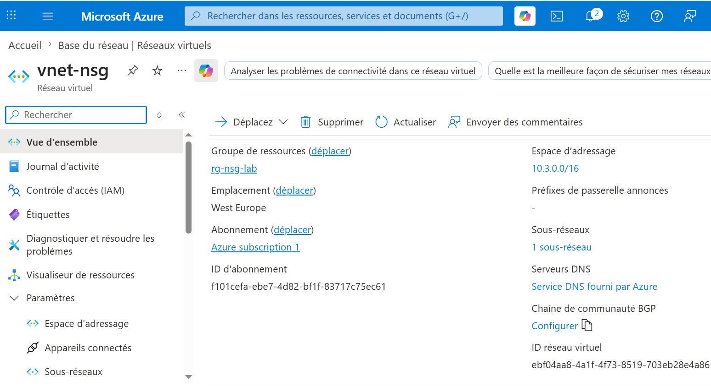
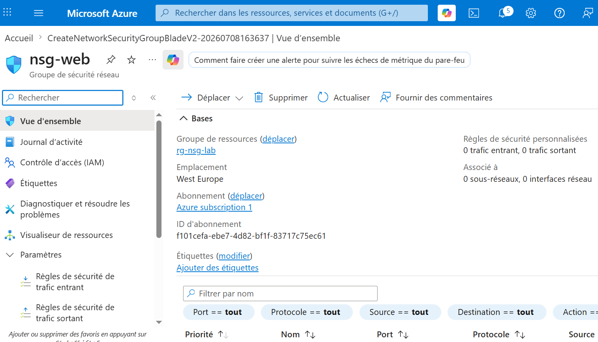
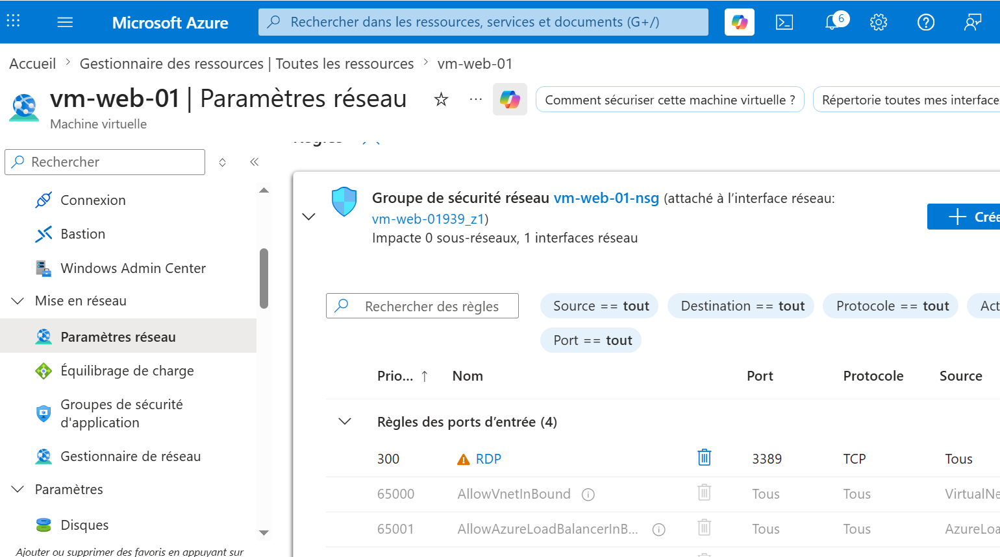
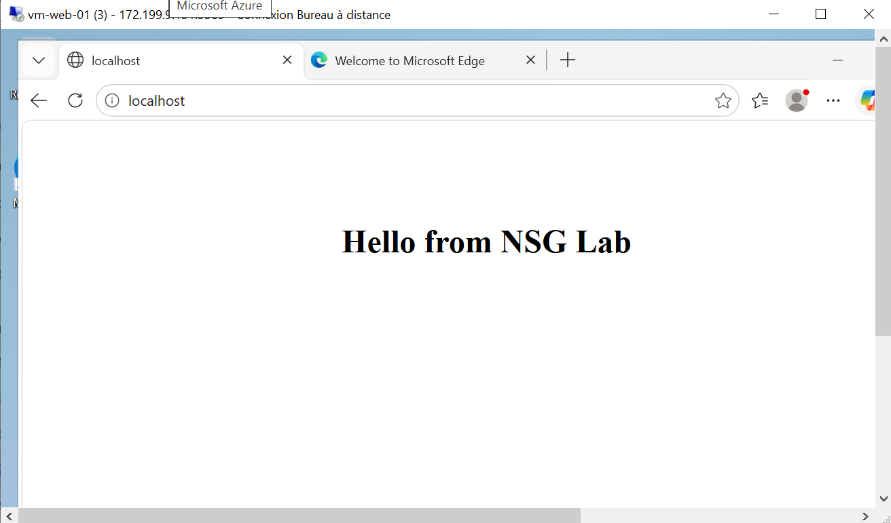
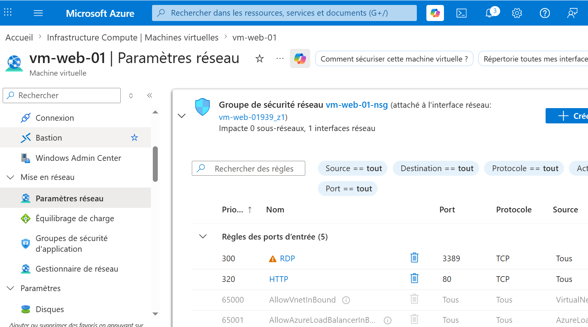
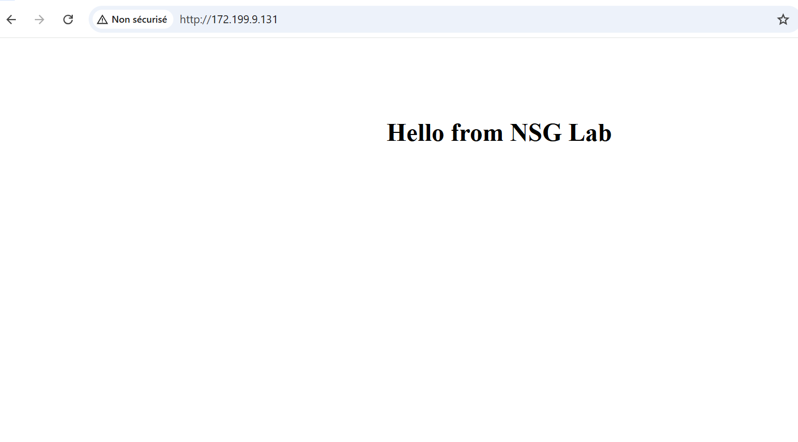
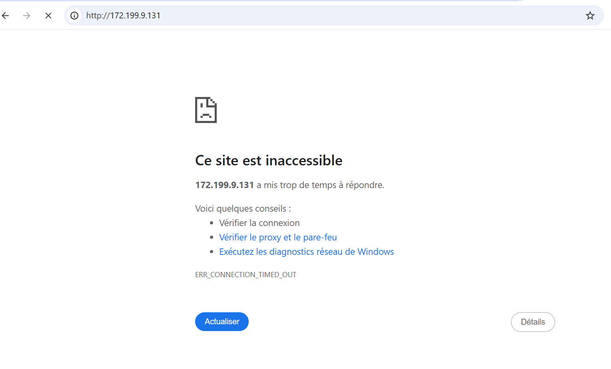

# Azure Network Security Group (NSG) Lab


---

## 🎯 Objectif

Déployer et configurer un **Azure Network Security Group (NSG)** afin de contrôler l'accès réseau à une machine virtuelle **Windows Server 2025** exécutant un serveur IIS.

Ce projet a été réalisé dans le cadre de ma préparation à la certification **Microsoft Azure AZ-104** afin de développer mes compétences en administration Cloud, en sécurisation des réseaux Azure et en gestion des règles de filtrage réseau.

---

## 🛠️ Technologies utilisées

- Microsoft Azure
- Azure Network Security Group (NSG)
- Windows Server 2025
- IIS (Internet Information Services)
- Azure Virtual Network (VNet)
- Azure Network Interface (NIC)
- Azure Public IP
- PowerShell

---

## 🏗️ Architecture

```text
                    Internet
                        │
                        ▼
                 Azure Public IP
                        │
                        ▼
              Network Security Group
                        │
                        ▼
              Network Interface (NIC)
                        │
                        ▼
                  VM-Web-01
             Windows Server 2025
                       IIS
                        │
                        ▼
             Virtual Network (VNet)
                  10.3.0.0/16
```

---

## 🎯 Résultat

Grâce à Azure Network Security Group :

- l'accès RDP est autorisé pour administrer la machine virtuelle ;
- l'accès HTTP est autorisé afin de publier le serveur IIS ;
- la suppression de la règle HTTP bloque immédiatement l'accès au site Web ;
- les tests démontrent que le NSG contrôle efficacement le trafic entrant vers la machine virtuelle.

Cette démonstration illustre le rôle des **Network Security Groups** dans la sécurisation des ressources Azure.

---

## 👤 Auteur

**Jair Da Silva**

Technicien Systèmes & Réseaux | Support IT N1/N2 | Microsoft Azure

GitHub : https://github.com/jairdasilva-it

LinkedIn : https://www.linkedin.com/in/jair-da-silva-6b14aa278

---

# 🚀 Étapes du projet

## 1️⃣ Création du réseau virtuel

- Création du Virtual Network
- Création du sous-réseau **vm-subnet**

---

## 2️⃣ Déploiement de la machine virtuelle

- Création d'une machine virtuelle Windows Server 2025
- Installation du rôle IIS
- Personnalisation de la page Web :
  - **Hello from NSG Lab**

---

## 3️⃣ Création du Network Security Group

- Création du NSG
- Création d'une règle RDP
- Association du NSG à l'interface réseau (NIC) de la machine virtuelle

---

## 4️⃣ Configuration de la règle HTTP

- Création d'une règle entrante HTTP (port 80)
- Vérification de l'accès au serveur IIS via l'adresse IP publique

---

## 5️⃣ Validation

- Suppression de la règle HTTP
- Vérification que le serveur Web devient inaccessible
- Validation du fonctionnement du filtrage réseau assuré par le NSG

---

# 📸 Captures d'écran

## 1. Réseau virtuel

Création du Virtual Network utilisé par la machine virtuelle.



---

## 2. Création du Network Security Group

Déploiement du Network Security Group.



---

## 3. Association du NSG à l'interface réseau

Association du Network Security Group à la carte réseau (NIC) de la machine virtuelle.



---

## 4. Installation d'IIS

Installation du rôle IIS et personnalisation de la page Web.



---

## 5. Création de la règle HTTP

Création de la règle autorisant le trafic HTTP sur le port 80.



---

## 6. Validation de l'accès HTTP

Accès réussi au serveur Web via l'adresse IP publique.



---

## 7. Blocage du trafic HTTP

Après suppression de la règle HTTP, le serveur Web devient inaccessible.



---

# 💼 Compétences démontrées

- Déploiement d'une infrastructure Microsoft Azure
- Administration de machines virtuelles Azure
- Installation et configuration d'IIS
- Déploiement d'un Azure Network Security Group (NSG)
- Association d'un NSG à une interface réseau (NIC)
- Configuration de règles de sécurité réseau
- Contrôle du trafic entrant (HTTP / RDP)
- Gestion des Virtual Networks (VNet)
- Administration Windows Server
- Validation d'une infrastructure avec PowerShell
- Sécurisation d'une machine virtuelle Azure
- Préparation à la certification Microsoft AZ-104
